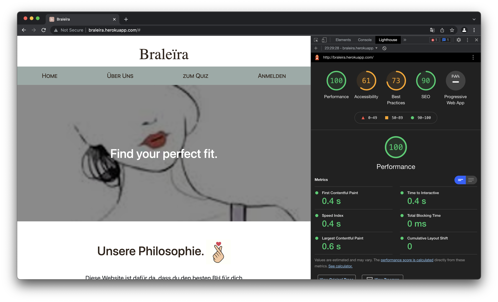

# Braleïra
##  Dokumentation - Hochschulprojekt mit Sails.js und Vue.js
 Webtechnologien Wintersemester 2021/2022 
Dozent: Prof. Eiglsperger

### Umsetzung der Arbeitsaufträge - Unser Vorgehen
Zu Anfang des Semesters haben wir viel Brainstorming betrieben und auf Papier skizziert, wie unsere Seite umgesetzt werden soll und wie unsere Funktionalitäten gestaltet und eingebunden werden sollten.
Mit dem Fortschreiten der Vorlesung und den dazukommenden technischen Neuerungen und Funktionalitäten haben wir angefangen ein GoogleDocs Dokument als ToDo Liste zu pflegen. Dieses haben wir dann nach dem Kanban Modell bearbeitet und fertige Punkte der Liste unter den Reiter Done geschoben.
Das Dokument hat uns zusätzlich immer ermöglicht zu sehen was für Programmiersprachen und Anwendungsarten als Anforderung der Seite gestellt waren.
 
In täglichen Webex-Meetings haben wir Ansätze besprochen, gemeinsam weitere Lösungen programmiert und Aufgabenteilung betrieben. 
Bei Problemen haben wir die zur Verfügung gestellten Demos aus Git herangezogen, viel gegoogelt und recherchiert.

### Zusammenfassung, Beschreibung der Funktionalität
+ BH-Größenquiz, dass die passenden Größen verschiedener Marken heraussucht 
	zu finden unter: `views/pages/size/quiz.ejs` und `views/pages/size/empfehlungen.ejs`
+ Anleitung für richtiges Vermessen + Auswerten an Hand der Größentabelle
	zu finden unter: `views/pages/size/quiz.ejs` und `views/pages/size/empfehlungen.ejs`
+ Angabe von Passformproblemen und Präferenzen
	zu finden unter: `views/pages/size/quiz.ejs` und `views/pages/size/empfehlungen.ejs`
+ BH Einträge in Datenbank anzeigen, suchen und pflegen (CRUD)
	zu finden unter den Seiten bei: `views/pages/bra/`
+ Zusätzliche Funktionen wie Login, Impressum und Kontaktseite 
 
 
### Highlights und WOW-Faktor der Seite
 
Es gibt sehr viele Seiten, die Frauen generell suggerieren, sie hätten die falsche BH-Größe und der BH muss anders sitzen. Die meisten Webseiten, Marken oder professionelle Beratungen im Laden, beginnen mit einer Messung und dem Kommentar “die Größe, die sie tragen, ist die falsche”. 
In unseren Augen gibt es jedoch keine “perfekte” BH-Größe, also ein richtig und ein falsch, sondern jede Frau entscheidet am besten selbst, was sie mag und was sie nicht mag, was ihr wichtig ist und welcher BH ihrer Meinung nach gut passt.
 
Mit unserem Quiz, dem Highlight der Webseite, ändern wir also den Ansatz, wie solche Beratungen ablaufen.
Einerseits schaffen wir das, indem wir der Kundin die Möglichkeit geben, anzugeben, was ihr bei der Passform des BHs wichtig ist, was die Kriterien sind, nachdem sie beurteilt, ob ein BH gut passt und welche Wünsche sie bezüglich der Passform eines BHs hat. 
Andererseits sammeln wir Passformdaten zu bereits gekauften und getragenen BHs der Kundin. Dabei stellen wir Fragen wie, welche Größe in welchem Modell bereits gut passen und was vielleicht trotzdem noch stört und verbessert werden kann. 
 
Aus diesen persönlichen Angaben und gesammelten Erfahrungsberichten können wir die in den Augen der Kundin perfekte BH-Größe empfehlen, was wir in unserer Empfehlungsseite am Ende des Quizzes andeuten. 
 
 
### Technische Implementierung
#### Quiz mit VUE zur Single Page Application
Unser Quiz haben wir mit Hilfe von VUE als Single Page Application implementiert. Es gibt vier Seiten, zwischen denen der Nutzer wechseln kann, ohne dass die Seite neu geladen wird.
Wir haben zuerst versucht, VUE direkt in einem `<script>` auf der Seite  einzubinden, aber hatten so Probleme mit dem VUE import. Nach längerem Googlen haben wir dann rausgefunden, dass man in Sails VUE über `parasails.registerPage` unter `assets/js/pages` einbindet, was wir dann unter `assets/js/pages/size/quiz.pages.js` gemacht haben.

#### Dynamische Suche mit AJAX + VUE
Unsere Bra-Suche für Admins haben wir ebenfalls mit VUE implementiert. Bei jeder Eingabe im Suchfeld wird automatisch eine Anfrage an den `bra/find` controller geschickt. Der Controller schickt dann die passenden Bras als JSON zurück.
Es werden zwei Parameter (`filterNach` und `wert`) mitgeschickt, mit denen dann Datenbankanfragen gemacht werden. Der Nutzer kann den `filterNach`-Wert über ein Dropdown auswählen.

Hier hatten wir zuerst noch Probleme, weil die Tabelle sich trotz neuen Sucheingaben nicht aktualisiert hat. Nach einigem Recherchieren im Internet haben wir das Problem dann gelöst bekommen, indem wir `{ cache: "no-cache" }` mit an die `fetch` Funktion übergeben haben.

Außerdem haben wir, ebenfalls mit Vue, in den Ergebnissen unserer Suche eine Löschfunktion eingebaut. Wenn der Nutzer auf den "Löschen" Knopf drückt, wird über AJAX eine Anfrage an das Backend geschickt und der Bra aus der Datenbank gelöscht. Danach entfernen wir den Bra mit der gelöschten ID aus unserer Tabelle, so dass diese sich aktualisiert ohne die Seite neu zu laden.
 
#### Javascript + jQuery
wurden von uns zum einen für das setzen der Verbindungen zum Backend verwendet und zum anderen um Funktionen aus dem Frontend durchführen zu können. Des weiteren haben wir außerdem beispielsweise die Kontaktseite dynamisch mit den beiden “Helfern” erzeugt.
Allgemein haben wir die Verwendung von vue jedoch jQuery vorgezogen, da wir dieses Framework besser und einfacher fanden. 
 
#### Style mit Bootstrap und CSS
Unsere Webseite haben wir größtenteils mit Bootstrap designed, was vieles vereinfacht hat und Content direkt dynamischer reagieren lies.
Natürlich haben wir auch eigene CSS-Klassen erstellt, welche im style.css zu finden sind.
Alles haben wir jedoch nicht als Klasse erzeugt, da wir das Sheet nicht mit nur einmal gebrauchten Klassen “zumüllen” wollten.
Das responsive Anpassen des Seitenlayouts auf unterschiedliche Bildschirmgrößen wie z.B. ein Handy haben wir nach dem Desktop First Ansatz integriert und dann mit Media Queries an verschiedene Bildschirme angepasst. 

##### Tafelaufschriebe -> zwei Arten Verbindungen zum Backend zu machen

|    | Client     |                   | Server                          |
|----|------------|-------------------|---------------------------------|
| P1 | HTML       | Link  HTML        | Routen, Action/Controller, View |
| P2 | Javascript | AJAX / Post; JSON | DB                              |

P1 haben wir beispielsweise beim Quiz verwendet. Der Nutzer bekommt von unserer App das Formular geschickt, das er dann ausfüllt. Wenn der Nutzer das Formular am Ende abschickt, wird dieses über einen POST-Request an die `/size` Route geschickt. Dadurch wird die `size/create`-Action gestartet, die diese Formulardaren bekommt, validiert, verarbeitet und dann in der Datenbank abspeichert. Anschließend wird ein Redirect auf die `/empfehlungen` Route zurückgegeben.

Im Gegensatz dazu verwendet unsere Suche den Ablauf P2. Anstatt bei jeder Änderung der Suche die ganze Site neu zu laden, schicken wir die Anfragen über AJAX (mit der `fetch` Funktion) an die `bra/find` Action, die dann die entsprechenden Bras aus der Datenbank als JSON zurückgibt. Vue nimmt dann diese Daten und aktualisiert die Tabelle dynamisch. 
Außerdem haben wir eine Lösch-Funktion implementiert, die ebenfalls mit `fetch` eine Anfrage an unser Backend schickt.

#### Datenbank - Aufbau, Fremdschlüsselbeziehungen
Die Informationen, die über den User im Quiz gesammelt werden, landen bei uns in verschiedenen Tabellen mit Fremdschlüsselbeziehungen zum `User` (`Messdaten`, `BraPassformdaten`, `BraTragekomfort`, `Farbe`, `Muster`, `Stoff`, `BhArt`). Daher verwenden wir hier jeweils einen Join mit den `collection` und `via` Attribute. Diese Beziehungen haben wir in beiden Modellen angelegt, der `User` zeigt also auf `Farbe` und umgekehrt. 
Aus Vereinfachungsgründen werden die BH-Einträge gesammelt in einer einzigen Tabelle `Bra` gespeichert. 
Die Passformdaten (Daten, die der User angibt, die einen bereits gekauften BH des Users betreffen und die Passform des gedachten BHs beschreiben) werden in einer One-to-One-Beziehung gespeichert, da wir uns entschieden hatten aus Vereinfachungsgründen, dass wir nur implementieren, dass der Nutzer einmal Passformdaten angeben kann (Siehe Kommentar im Model). Daher verwenden wir hier einen Fremdschlüssel auf das `User` Modell. Das machen wir, indem wir das `model` Attribut in Kombination mit `unique: true` verwenden.
Wenn man das Datenbankmodell vollumfänglich und korrekt gestalten wollen würden, mit mehr Zeit als im Rahmen einer Webtech-Vorlesung, würde man:

1. die Daten wie Farbe, Muster und Stoff etc. zusätzlich in eine Collection mit dem Bra tun, wie sie mit dem User sind und dann somit mit dem User und mit dem Bra verbinden. 
2. die Passformdaten ebenfalls in eine Collection mit User packen
3. die Passformdaten vielleicht eleganter in mehrere Tabellen aufteilen, als einen Haufen booleans am Ende und unterteilen in z.B. eine Tabelle Körbchenpassform, eine Unterbrustbandpassform und dann zusätzlich noch die Passformgröße und dann alles durch Collections mit dem User verbinden. 

#### Data Validation

Im Frontend haben wir die einegebenen Daten auf zwei Arten validiert. Zum Einen haben wir unsere `<input>` Elemente wo möglich mit Attributen wie `required`, `maxLength`, und `min` versehen.

Im Größenquiz war das allerdings nicht ausreichend, da dieses über mehrere Seiten geht und die Fehler auf den ersten Seiten für den Nutzer beim Absenden des Formulars nicht sichtbar wären.
Deswegen haben wir hier zusätzlich Vue eingesezt, um auf der letzten Seite unter dem Button Fehlermeldungen einzublenden wenn Eingabefehler bestehen.
Zusätzlich haben wir, um das Problem zu umgehen, auf der ersten Seite den Weiter-Button deaktiviert, bis die Felder für Unterbrustbreite und Brustumfang ausgefüllt wurden. Wir haben uns aber entscheiden die Buttons für die individuellen Seiten oben auf der Seite nicht zu deaktivieren, damit Nutzer sich wenn sie das wollen die nächsten Seiten trotzdem schon anschauen können.

Im Backend verwenden wir die `inputs` von unseren Actions um sicherzustellen, dass die Daten korrekt sind. Trotz der Validierung im Frontend validieren wir hier zur Sicherheit alle Daten nochmal.

Was zur Data Validation vielleicht noch als Frage aufkommen könnte, ist warum wir auf der Admin - create a bra oder auch bei update a bra - Seite(n) nicht die Eingabe der Größe auf z.B. alles von 70-100 und dann A-H beschränkt haben, wie auch bei der Eingabe der Passformdaten des normalen Users. 

1. Es gibt viele unterschiedliche Größen und Marken haben auch oft ihre eigenen Größensysteme. Wir wollen theoretisch in der Lage sein, alle BH-Modelle einpflegen zu können. Besonders häufig bei Sport-Bhs sind auch die Größen S, M und L; die könnte man dann ebenfalls nicht verwenden.

2. Die Seite ist nur für Admins zugänglich, daher ist die Gefahr, dass Quatsch eingetragen wird geringer. Deswegen haben wir uns auch bei den Passformdaten des Users innerhalb des Quizzes dafür entschieden, diese Eingabe erst einmal zu beschränken. Mit mehr Zeit, könnte man dem User dann noch genauer andere Größen anbieten.

#### Benutzergruppen und Rechte
Die Benutzergruppen sind folgende:
Der nicht-angemeldete-User darf unsere Homepage, das Impressum und die Kontaktseite anschauen, sowie sich registrieren und anmelden.
Der angemeldete-User kann das Größenquiz ausfüllen und sich daraus dann Empfehlungen anzeigen lassen.
Die Admins(und auch die Super-Admins natürlich) der Webseite können zusätzlich die BH-Einträge der Datenbank verwalten. Dies geschieht auf der Übersicht, über die BH-Einträge gesucht, bearbeitet und gelöscht werden können und über "neuen BH erstellen" `bra/new.ejs`. 
#### Cookies
Ein Cookie-Banner haben wir ebenfalls auf der Seite implementiert. Beim ersten Laden der Seite poppt dieses auf. Sie können direkt akzeptiert oder durch Klicken auf “Cookies einstellen” noch individuell angepasst werden.
Sind sie einmal akzeptiert, muss der User kein weiteres Mal akzeptieren, da sie an den Browser gekoppelt sind.
Umgesetzt haben wir dies mit zwei Modalen, die auf “show” oder “hide” gesetzt werden, je nachdem welche Funktion aufgerufen wird bzw. welcher Button gedrückt wird.
Wenn der Nutzer die Cookies akzeptiert, setzen wir in seinem Browser einen `cookies_erlaubt` Cookie, der verhindert, dass das Banner beim nächsten mal wieder angezeigt wird.
Zu finden ist die Programmierung unter `view/layouts/layout.ejs`.

#### Geschäftsprozess mit Session über mehrere Seitenaufrufe
Das Aktualisieren von BH-Einträgen haben wir als mehrseitiges Formular implementiert. Im Gegensatz zum Größenquiz haben wir hier nicht VUE verwendet, sondern das Formular über mehrere Actions und Views verteilt. Um dabei die Daten des aktualisierten BHs nicht zu verlieren, speichern wir diese in der Session. Wenn der Nutzer auf der ersten Seite Aktualisieren drückt, bekommt er eine neue Seite angezeigt, die die neuen Werte mit den alten Werten vergleicht. Erst wenn der Nutzer diese Werte geprüft und bestätigt hat, werden diese tatsächlich in der Datenbank gespeichert.
#### Funktionalität
##### Geschäftsprozesse auflisten:
+ ###### Benutzer füllt Quiz aus und Empfehlungen werden angezeigt 
+ ###### Admin lässt sich Liste anzeigen (CRUD)
+ ###### Admin löscht BH-Eintrag (CRUD)
+ ###### Admin bearbeitet BH-Eintrag (CRUD) 
+ ###### Admin erstellt BH-Eintrag (CRUD)
##### Inhaltliche Anforderungen
+ ###### Impressum 
Impressum: `views/pages/legal/impressum.ejs`
+ ###### Kontaktseite 
Kontaktseite: `views/pages/legal/kontaktseite.ejs`
Die Kontaktseite ist auf der Impressumsseite unten verlinkt. 
+ ###### SEO & Performance

On-Page SEO

Die Inhalte unserer Homepage erhalten durch den Abschnitt "Unsere Philosophie" und der Beschreibung unseres Größenquizzes viele Keywords und Phrasen, die das Ranking in allgemeinen Suchmaschinen beeinflussen. Außerdem sind unsere URLs aussagekräftig und somit für den Nutzer leicht lesbar. Unsere Seite ist freundlich und ansprechend gestaltet.

Technische SEO & Performance

Der Analyse mit Google Lighthouse entsprechend haben wir noch weitere Meta-Tags in die Layout-Datei `view/layouts/layout.ejs` unserer Website geschrieben. Mit Hilfe dieser Tags machen wir es dem Nutzer so leichter, uns durch eine Suche der z.B. folgenden Schlüsselwörter zu finden:
+ BH,
+ BH-Größe,
+ passender Bh,
+ bh-Quiz,
+ braleira

Man sollte nicht mehr als 10 Keywords verwenden, weswegen wir uns auf 10 beschränkt haben. 
Außerdem haben wir einen Meta Tag mit einer kurzen und passenden Beschreibung unserer Website hinzugefügt: “Finde einen perfekt passenden BH mit Hilfe unseres Größenquizzes.”

Mobile                                  |  Desktop
:--------------------------------------:|:----------------------------------------:
 | 

Die Analyse mit Google Lighthouse hat eine Performance von 100 in der Desktop Version ergeben und 94 in der Mobile Version. (HTML Dateien ebenfalls in `Documentation` wie auch Bilder)

Off Page Optimization

Unser Social Media.
+ ###### Social Media Accounts
Auf unserer Empehlungsseite ganz am Ende geben wir dem User die Möglichkeit auf drei Social Media Plattformen über uns zu posten (Twitter, Pinterest und Facebook) und auf der Homepage sind die Social Media Links sehr präsent.

https://braleira.herokuapp.com   //originally deployed on heroku, link not working anymore

